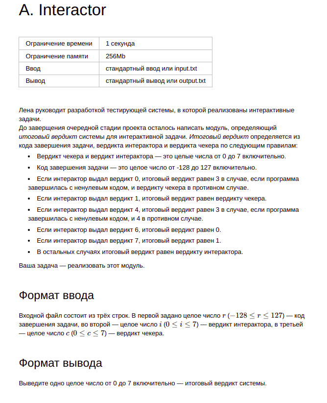

# Тренировки по алгоритмам от Яндекса
---
## Содержание

- Лекция 1: «Сложность, тестирование, особые случаи»
  - [Interactor](#Intercator)
  - Кольцевая линия метро
  - Даты
  - Строительство школы
  - Точка и треугольник
  - Количество равных максимальному
  - Дома и магазины
  - Изготовление палиндромов
  - Лавочки в атриуме
  - Дипломы в папках
- Лекция 2: «Линейный поиск»
  - 1 Задача
  - 2 задача
- Лекция 3: «Множества»
  - 1 Задача
  - 2 задача
- Лекция 4: «Словари и сортировка подсчётом»
  - 1 Задача
  - 2 задача
- Лекция 5: «Префиксные суммы и два указателя»
  - 1 Задача
  - 2 задача
- Лекция 6: «Бинарный поиск»
  - 1 Задача
  - 2 задача
- Лекция 7: «Сортировка событий»
  - 1 Задача
  - 2 задача
- Лекция 8: «Деревья»
  - 1 Задача
  - 2 задача

## Лекция 1: «Сложность, тестирование, особые случаи»

### Interactor

Условие:

[Решение](src/main/java/lection1/Interactor.java)
  
Тесты:
