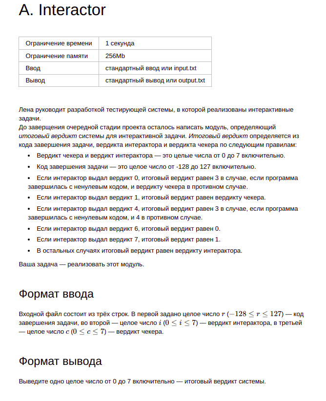
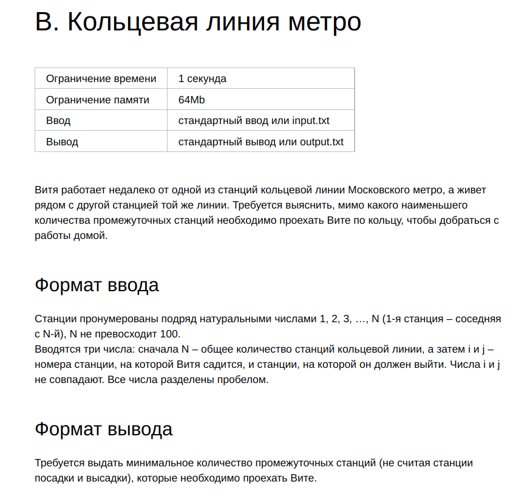
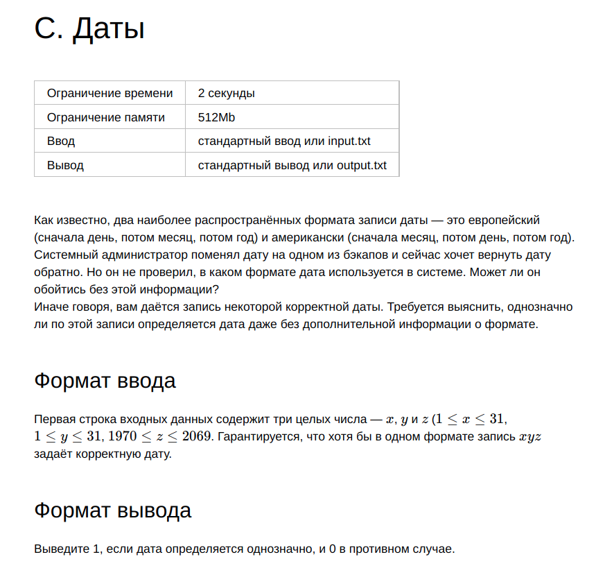
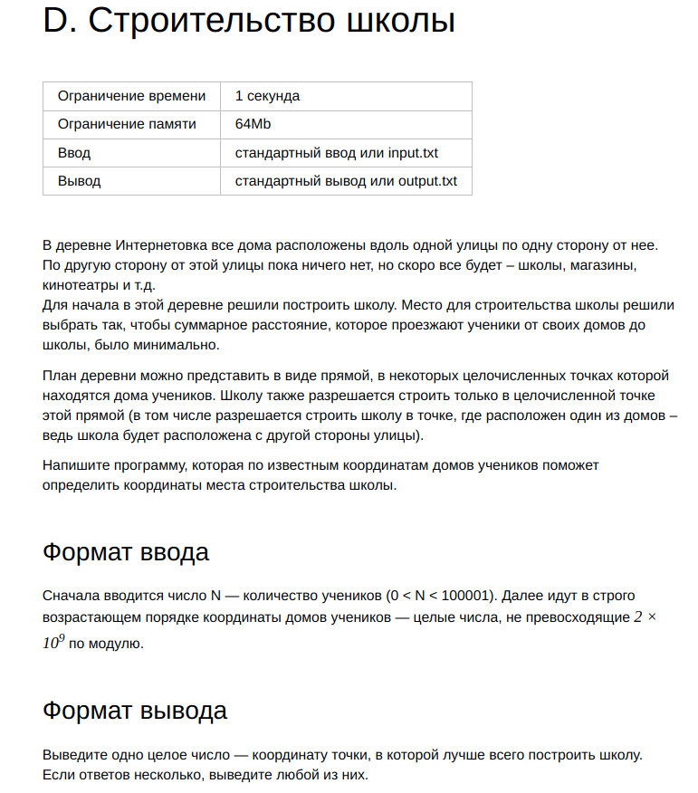
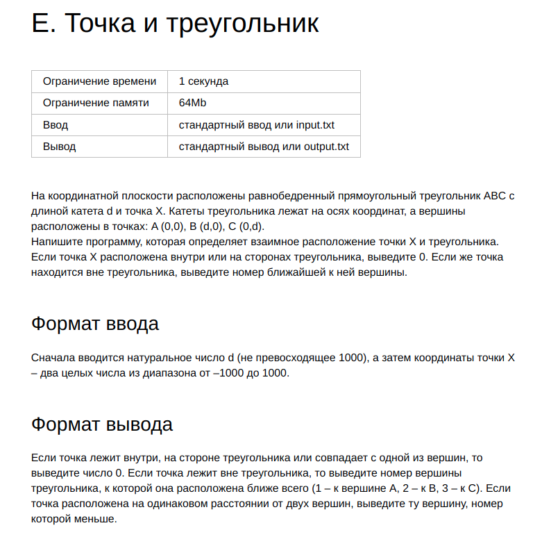
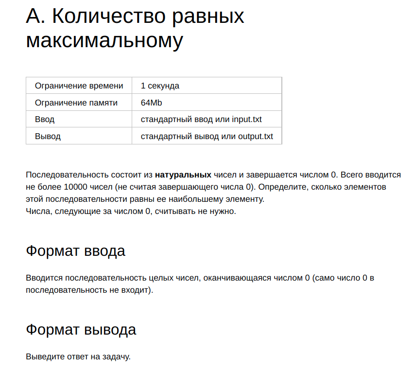
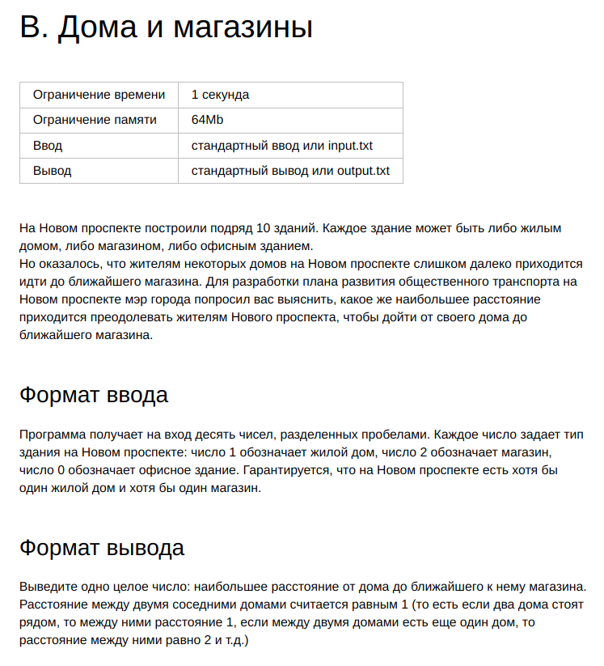
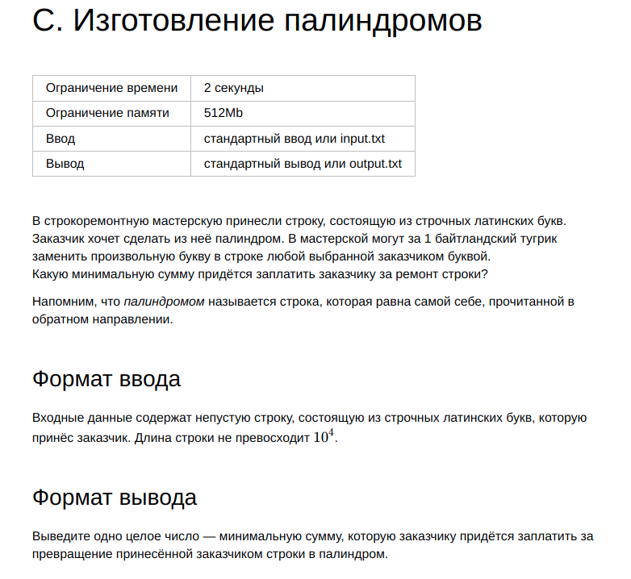
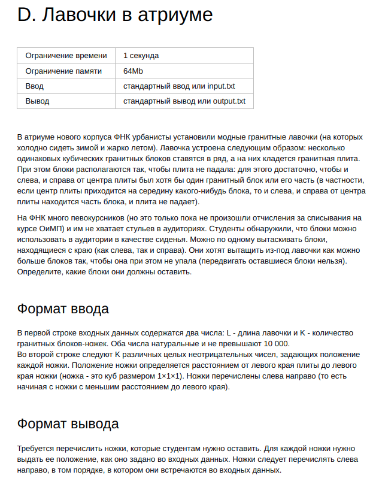
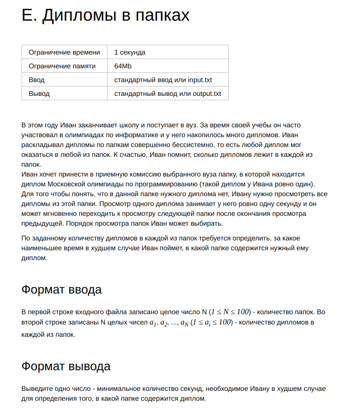

# Тренировки по алгоритмам от Яндекса

## Содержание

- [Лекция 1: «Сложность, тестирование, особые случаи»](#лекция-1-сложность-тестирование-особые-случаи)
  - [Interactor](#interactor)
  - [Кольцевая линия метро](#кольцевая-линия-метро)
  - [Даты](#даты)
  - [Строительство школы](#строительство-школы)
  - [Точка и треугольник](#точка-и-треугольник)
  - [Количество равных максимальному](#количество-равных-максимальному)
  - [Дома и магазины](#дома-и-магазины)
  - [Изготовление палиндромов](#изготовление-палиндромов)
  - [Лавочки в атриуме](#лавочки-в-атриуме)
  - [Дипломы в папках](#дипломы-в-папках)
- [Лекция 2: «Линейный поиск»](#лекция-2-линейный-поиск)
- [Лекция 3: «Множества»](#лекция-3-множества)
- [Лекция 4: «Словари и сортировка подсчётом»](#лекция-4-словари-и-сортировка-подсчётом)
- [Лекция 5: «Префиксные суммы и два указателя»](#лекция-5-префиксные-суммы-и-два-указателя)
- [Лекция 6: «Бинарный поиск»](#лекция-6-бинарный-поиск)
- [Лекция 7: «Сортировка событий»](#лекция-7-сортировка-событий)
- [Лекция 8: «Деревья»](#лекция-8-деревья)

## Лекция 1: «Сложность, тестирование, особые случаи»

### Interactor

Условие:

[Решение](src/main/java/lection1/Interactor.java)
  
[Тесты](src/test/java/lection1/InteractorTests.java)

### Кольцевая линия метро

Условие:

[Решение](src/main/java/lection1/RingMetroLine.java)

[Тесты](src/test/java/lection1/RingMetroLineTests.java)

### Даты

Условие:

[Решение](src/main/java/lection1/Date.java)

[Тесты](src/test/java/lection1/DateTests.java)

### Строительство школы

Условие:

[Решение](src/main/java/lection1/SchoolConstruction.java)

[Тесты](src/test/java/lection1/SchoolConstructionTests.java)

### Точка и треугольник

Условие:

[Решение](src/main/java/lection1/PointAndTriangle.java)

[Тесты](src/test/java/lection1/PointAndTriangleTests.java)

### Количество равных максимальному

Условие:

[Решение](src/main/java/lection1/NumberEqualMax.java)

[Тесты](src/test/java/lection1/NumberEqualMaxTests.java)

### Дома и магазины

Условие:

[Решение](src/main/java/lection1/HomesAndShops.java)

[Тесты](src/test/java/lection1/HomesAndShopsTests.java)

### Изготовление палиндромов

Условие:

[Решение](src/main/java/lection1/MakingPalindromes.java)

[Тесты](src/test/java/lection1/MakingPalindromesTests.java)

### Лавочки в атриуме

Условие:

[Решение](src/main/java/lection1/BenchesInAtrium.java)

[Тесты](src/test/java/lection1/BenchesInAtriumTests.java)

### Дипломы в папках

Условие:

[Решение](src/main/java/lection1/DiplomasInFolders.java)

[Тесты](src/test/java/lection1/DiplomasInFoldersTests.java)

## Лекция 2: «Линейный поиск»

## Лекция 3: «Множества»

## Лекция 4: «Словари и сортировка подсчётом»

## Лекция 5: «Префиксные суммы и два указателя»

## Лекция 6: «Бинарный поиск»

## Лекция 7: «Сортировка событий»

## Лекция 8: «Деревья»